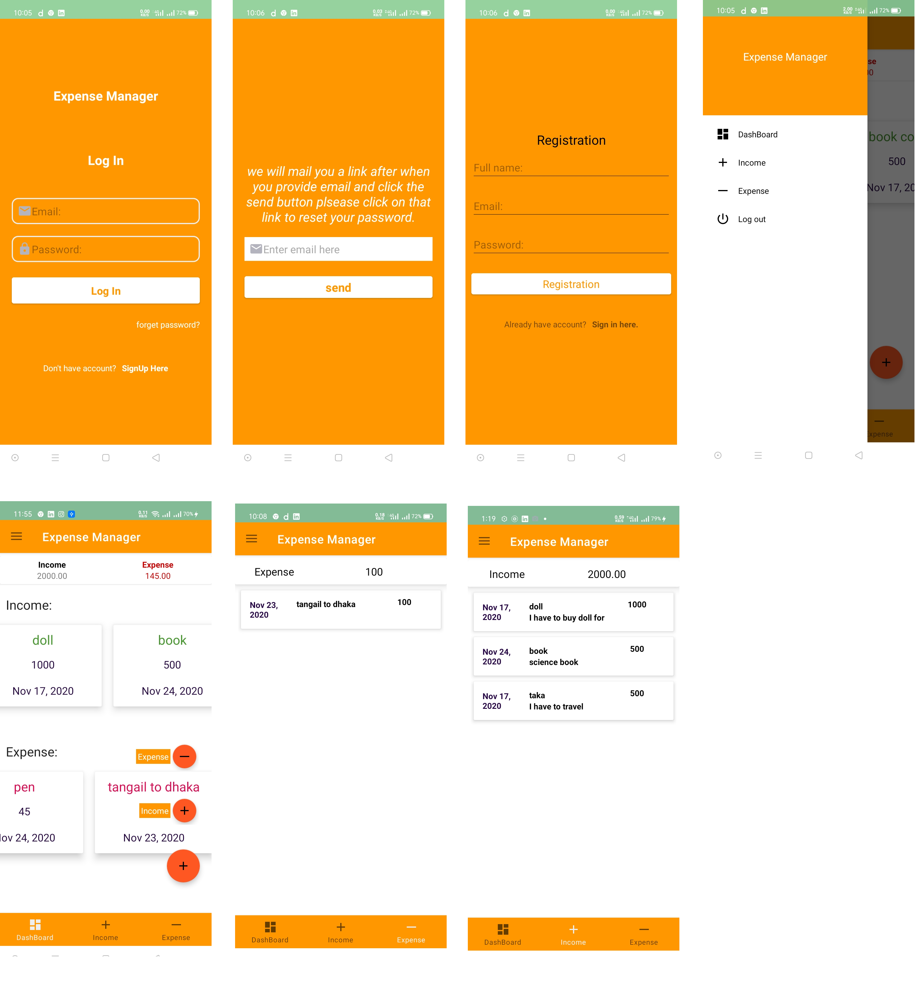

# Expense Manager

###Components used in Expense Manager App:
* Navigation drawer.
* CardView.
* RecyclerView.
* Bottom Navigation Button.
* Custom EditText
* Firebase Realtime Database.
* Email Authentication.
* Firebase Reset Password.
* Floating Action Button.
